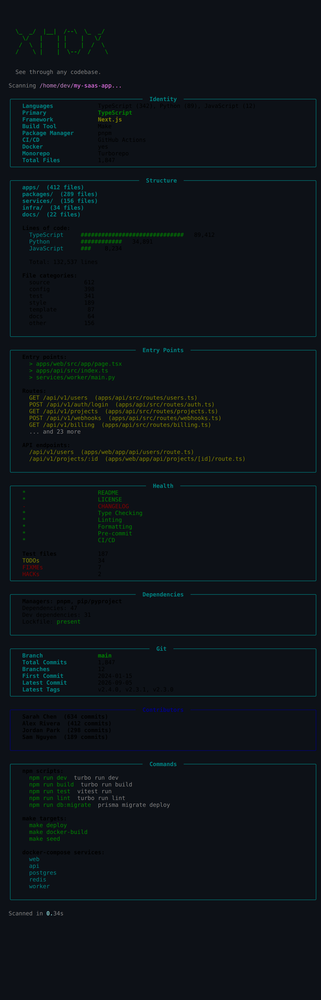

<div align="center">


**See through any codebase.**

<sub>Clone a repo. Run one command. Understand everything.</sub>

<br>

[](https://python.org)
[](LICENSE)
[](https://github.com/KazamaDono/xray)

<br>



</div>

---

## `> cat problem.txt`

```
You clone a new repo.

Now you need to figure out: what language? what framework? where are the entry
points? how do I run it? what are the npm scripts? the make targets? how many
dependencies? is there CI? tests? linting? who contributed? what files change
the most?

You open README (if it exists). You grep. You read package.json. You check
for a Makefile. You look at the directory tree. You read pyproject.toml.
You run git log. You check for docker-compose.

That takes 10-15 minutes every single time.
```

xray does it in under a second.

---

## `> xray --help`

```
usage: xray [-h] [-v] [-q] [--json] [--no-banner] [--no-git] [--version] [path]

See through any codebase. Instant project intelligence from your terminal.

positional arguments:
  path          Path to project root (default: current directory)

options:
  -v, --verbose   Show extended details (routes, TODOs, hot files, deps list)
  -q, --quiet     Minimal output
  --json          Output as JSON (pipe to jq, feed to scripts)
  --no-banner     Skip the ASCII banner
  --no-git        Skip git analysis
  --version       Show version
```

---

## `> xray --checks`

<div align="center">

| Section | What it finds |
|:---:|---|
| **Identity** | Languages, framework, package manager, CI/CD, Docker, monorepo tool |
| **Structure** | Directory layout, LOC by language, file categories, largest files |
| **Entry Points** | Main files, API routes, endpoints, config files |
| **Health** | README/LICENSE/CHANGELOG, type checking, linting, formatting, pre-commit, CI, TODOs/FIXMEs/HACKs, test coverage |
| **Dependencies** | All package managers, dep counts, lockfile presence |
| **Git** | Branch, commits, contributors, hot files, tags, remotes, uncommitted changes |
| **Commands** | npm scripts, Makefile targets, Justfile recipes, docker-compose services, scripts/ |

</div>

---

## `> pip install xray-cli`

```bash
pip install xray-cli
```

Or from source:

```bash
git clone https://github.com/KazamaDono/xray
cd xray
pip install -e .
```

---

## `> xray /path/to/anything`

Works on any project. Detects 25+ languages, 30+ frameworks, 14 package managers, 7 CI systems, 4 monorepo tools. Parses `package.json`, `pyproject.toml`, `Cargo.toml`, `go.mod`, `Gemfile`, `composer.json`. Finds routes in Express, FastAPI, Django, Flask, Spring, Rails.

```bash
# scan current directory
xray

# scan a specific project
xray ~/projects/my-app

# verbose mode (shows all routes, TODOs, hot files)
xray -v

# json output (pipe to jq, use in scripts)
xray --json | jq '.identity.primary_language'

# quick check on something you just cloned
git clone https://github.com/someone/something && xray something
```

---

## `> cat supported.txt`

**Languages**: Python, JavaScript, TypeScript, Go, Rust, Ruby, Java, Kotlin, Scala, C, C++, C#, PHP, Swift, Lua, Zig, Elixir, Haskell, Dart, Vue, Svelte, Solidity

**Frameworks**: Next.js, Nuxt, SvelteKit, Astro, Remix, Angular, Gatsby, Vite, Webpack, Django, Flask, FastAPI, Streamlit, Express, Fastify, Hono, React, Vue, Rails, Maven, Gradle, Laravel, Flutter, CMake

**Package Managers**: npm, Yarn, pnpm, Bun, pip, Pipenv, Poetry, PDM, uv, Cargo, Go Modules, Bundler, Composer, pub

**CI/CD**: GitHub Actions, GitLab CI, Jenkins, CircleCI, Travis CI, Bitbucket Pipelines, Buildkite

---

<div align="center">

<sub>Built by <a href="https://github.com/KazamaDono">KazamaDono</a></sub>

</div>
