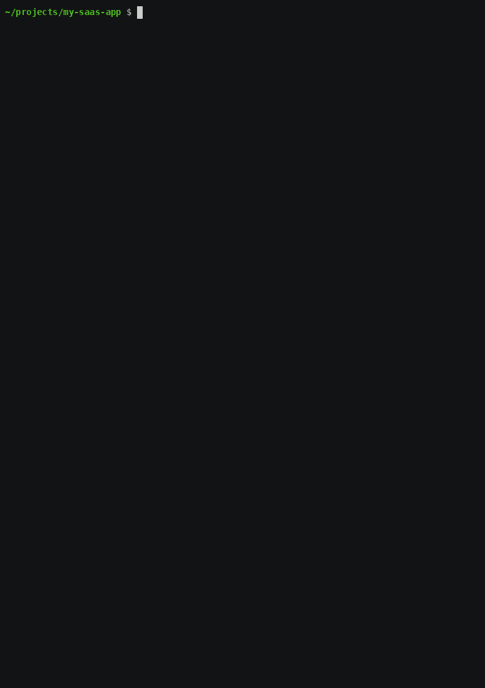
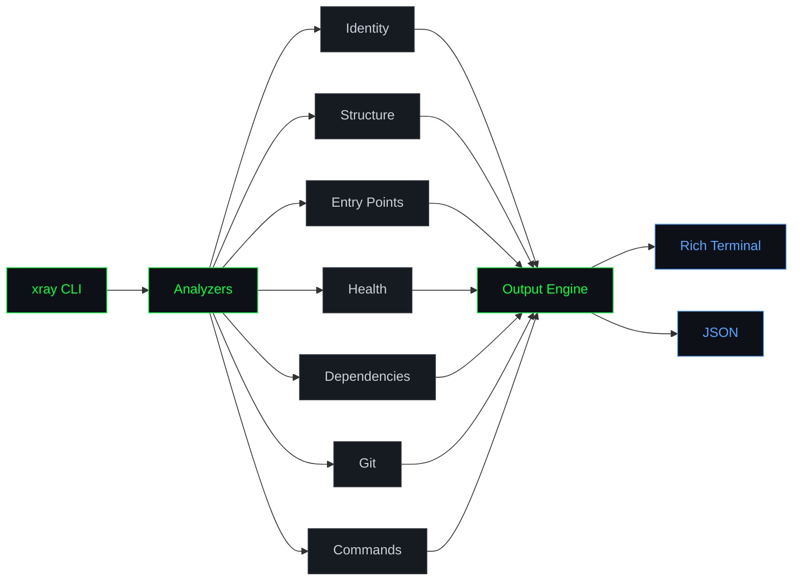
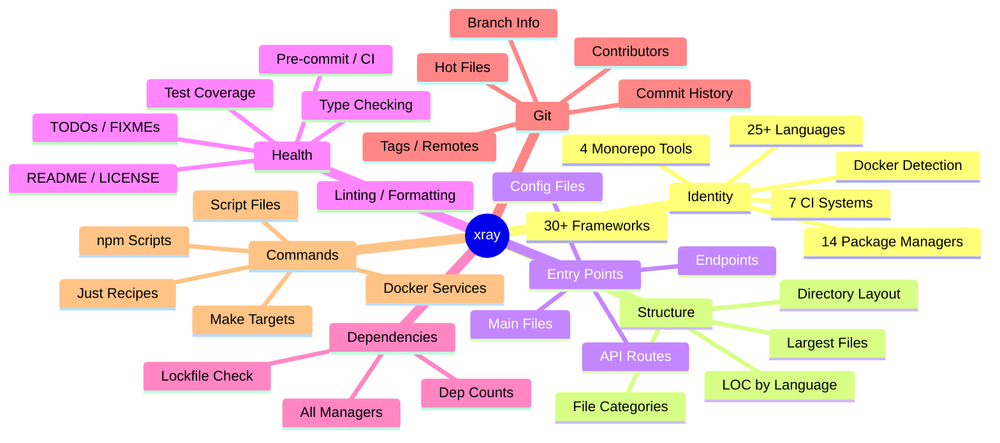
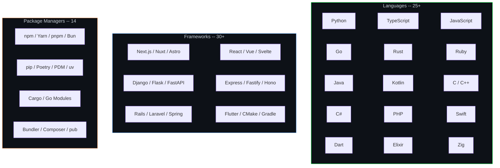

<div align="center">


**See through any codebase.**

<sub>Clone a repo. Run one command. Understand everything.</sub>

<br>

[](https://python.org)
[](LICENSE)
[](https://github.com/KazamaDono/xray)

---



</div>

<br>

## `> cat problem.txt`

Every time you clone a repo, you spend 10-15 minutes doing the same thing: reading the README (if it exists), checking `package.json`, looking for a `Makefile`, reading `pyproject.toml`, running `git log`, opening `docker-compose.yml`. You're mentally stitching together the same picture every single time.

**xray does it in under a second.**

One command gives you the full picture: what the project is built with, how it's structured, where the entry points are, how healthy the codebase is, what commands you can run, and who's been working on it.

---

## `> xray --architecture`



---

## `> xray --analyzers`



---

## `> pip install xray-cli`

```bash
pip install xray-cli
```

Or from source:

```bash
git clone https://github.com/KazamaDono/xray
cd xray
pip install -e .
```

---

## `> xray --help`

```
usage: xray [-h] [-v] [-q] [--json] [--no-banner] [--no-git] [--version] [path]

See through any codebase. Instant project intelligence from your terminal.

positional arguments:
  path          Path to project root (default: current directory)

options:
  -v, --verbose   Show extended details (routes, TODOs, hot files, deps list)
  -q, --quiet     Minimal output
  --json          Output as JSON (pipe to jq, feed to scripts)
  --no-banner     Skip the ASCII banner
  --no-git        Skip git analysis
  --version       Show version
```

---

## `> xray --examples`

```bash
# scan current directory
xray

# scan a specific project
xray ~/projects/my-app

# verbose mode -- all routes, every TODO, hot files, full dep list
xray -v

# json output -- pipe to jq, use in scripts, feed to other tools
xray --json | jq '.identity.primary_language'

# quick recon on something you just cloned
git clone https://github.com/someone/something && xray something

# compare two projects
diff <(xray projectA --json | jq '.identity') <(xray projectB --json | jq '.identity')

# check project health in CI
xray --json | jq -e '.health.has_linting and .health.has_type_checking'
```

---

## `> xray --what-it-finds`

<div align="center">

| Analyzer | What it detects |
|:---|:---|
| **Identity** | Primary language, framework (Next.js, Django, Rails, etc.), package manager, CI/CD system, Docker, monorepo tool |
| **Structure** | Top-level directory layout, lines of code per language with visual bars, file breakdown by category (source/test/config/docs/style) |
| **Entry Points** | Main files, CLI entry points, API routes (Express, FastAPI, Django, Flask, Spring), Next.js file-based routes, config files |
| **Health** | README, LICENSE, CHANGELOG presence. Type checking, linting, formatting, pre-commit hooks, CI/CD. TODO/FIXME/HACK counts with locations. Test file count |
| **Dependencies** | Parses package.json, requirements.txt, pyproject.toml, Cargo.toml, go.mod, Gemfile, composer.json. Counts deps vs dev-deps. Checks lockfile |
| **Git** | Current branch, total commits, contributor list with commit counts, most-changed files, tags, remotes, uncommitted changes, project age |
| **Commands** | npm/yarn scripts with their commands, Makefile targets, Justfile recipes, docker-compose services, executable scripts in bin/ scripts/ tools/ |

</div>

---

## `> xray --detection-matrix`



---

## `> xray --json`

Every section is available as structured JSON. Pipe it, parse it, build on it.

```json
{
  "identity": {
    "primary_language": "TypeScript",
    "framework": "Next.js",
    "package_manager": "pnpm",
    "ci": "GitHub Actions",
    "docker": true,
    "monorepo": "Turborepo"
  },
  "structure": {
    "total_files": 1847,
    "total_loc": 132537,
    "loc_by_language": [["TypeScript", 89412], ["Python", 34891]]
  },
  "health": {
    "readme": true,
    "has_type_checking": true,
    "has_linting": true,
    "todo_count": 34,
    "fixme_count": 7,
    "test_files": 187
  },
  "git": {
    "total_commits": 1847,
    "branch": "main",
    "contributors": [["Sarah Chen", 634], ["Alex Rivera", 412]]
  },
  "_meta": {
    "scan_time": 0.34,
    "version": "1.0.0"
  }
}
```

---

## `> xray --design`

```
No config files. No setup. No API keys.
No network requests. Runs entirely offline.
No dependencies beyond Rich.
Single pip install. Works on Python 3.9+.

Intelligently skips virtual environments (detects pyvenv.cfg),
node_modules, __pycache__, .git, build artifacts, and 30+ other
generated directories so you see signal, not noise.

Scans a 3,000-file project in under a second.
```

---

<div align="center">

<sub>Built by <a href="https://github.com/KazamaDono">KazamaDono</a></sub>

</div>
